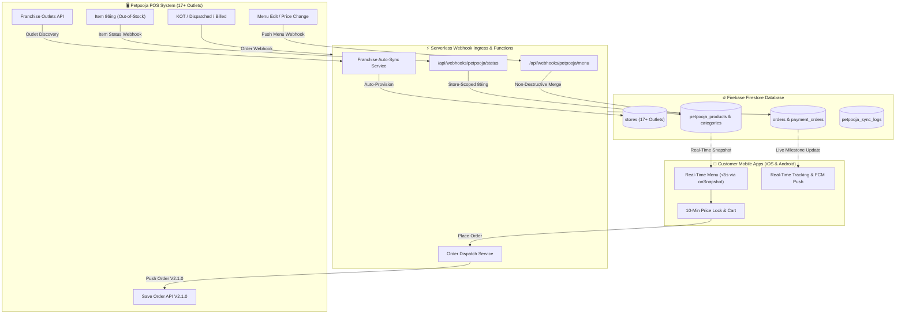

# 🍔 BURGONOMICS — Product & Architecture Blueprint
### Complete Specification for Multi-Outlet Mobile Ordering, Real-Time Petpooja POS Synchronization, and Native iOS / Android Distribution

---

## 1. Executive Summary

**BURGONOMICS** is a high-growth quick-service gourmet burger chain operating across **17+ restaurant outlets** (and expanding). This document defines the master architectural and product blueprint for the customer mobile applications (iOS and Android via Capacitor), web client, backend serverless functions, and bi-directional integration with the **Petpooja POS** ecosystem.

---

## 2. 🎨 Brand Identity & Visual Design System

The application follows the **60-30-10 Visual Rule** tailored for clean, appetite-inducing, mobile-first food ordering:

```
┌────────────────────────────────────────────────────────────────────────┐
│                                                                        │
│   ⬜ 60% WHITE CANVAS (#FFFFFF)                                        │
│   • Backgrounds, sheet surfaces, cards, product listings               │
│   • High readability, modern Swiggy/Zomato-grade whitespace            │
│   • Deep high-contrast near-black typography (#16281D)                 │
│                                                                        │
├────────────────────────────────────────────────────────────────────────┤
│                                                                        │
│   🟩 30% BURGONOMICS GREEN (#0E4825 | R:14, G:72, B:37)                │
│   • Top header bar, bottom tab bar accents, primary buttons & CTAs     │
│   • Selected category chips, active fulfillment tabs, card borders     │
│                                                                        │
├────────────────────────────────────────────────────────────────────────┤
│                                                                        │
│   🟧 10% VIBRANT ORANGE (#FF6600 | R:255, G:102, B:0)                  │
│   • Promo badges, discount tags, bestseller highlights, loyalty coins  │
│   • "ADD" / Quantity stepper accents, live order tracking pulses       │
│                                                                        │
└────────────────────────────────────────────────────────────────────────┘
```

### Typography Hierarchy
- **`MonstroSolid`** (`--font-display`): Brand identity, logo lockup, section hero headers, and promotional banner titles.
- **`Montserrat`** (`--font-sans`, weights 300–900): All UI content, product titles, descriptions, modifier options, prices, navigation items, and body copy.

---

## 3. ⚡ Petpooja POS Integration Architecture (< 5s Sync)

The Petpooja integration operates via a serverless webhook ingestion gateway and backend order dispatcher:



### Ingestion & Sync Rules
1. **Near-Instant Menu Ingestion (< 5 Seconds)**:
   - When menu changes (price updates, new items, category adjustments) are saved in Petpooja, a `push_menu` HTTP webhook is posted to `/api/webhooks/petpooja/menu`.
   - The webhook parses the datagram and batch-writes updates to Firestore (`petpooja_products`, `petpooja_categories`, `petpooja_addons`).
   - Mobile apps subscribe via Firestore `onSnapshot` listeners, invalidating React Query caches in real-time without requiring app restarts or manual pull-to-refresh.

2. **Non-Destructive Field Merge**:
   - **Petpooja-Authoritative Fields**: `price`, `active`, `stockStatus`, `name`, `description`, `variations`, `addons`, `taxRate`.
   - **Admin-Enriched Fields (Preserved)**: High-resolution hero food photography (`heroImageUrl`), marketing badges (`"Bestseller"`, `"Chef's Special"`, `"New"`), spice level indicators, and dietary/calorie metadata.

3. **In-Flight Checkout Protection (10-Minute Price Lock)**:
   - When an item is added to the cart, a 10-minute price lock window is established.
   - If an item is modified or 86ed in Petpooja while the customer is actively checking out within that 10-minute window, the original price is honored. After 10 minutes of inactivity, the cart automatically re-validates against the latest live catalog.

---

## 4. 🛵 Fulfillment & Dual Payment Matrix

Burgonomics supports three distinct fulfillment modes across all 17+ outlets:

| Fulfillment Mode | Online Payment (Razorpay) | Counter / Delivery Payment | Operational Details |
| :--- | :--- | :--- | :--- |
| **Delivery** | Credit/Debit Cards, UPI, NetBanking, Wallets (`PREPAID`) | **Pay on Delivery (Cash/UPI)** (`COD`) | GPS validates delivery address is within the store's delivery radius (e.g. 5–7 km). Dispatches delivery rider KOT to POS. |
| **Takeaway** | Credit/Debit Cards, UPI, NetBanking, Wallets (`PREPAID`) | **Pay at Counter** (`UNPAID`) | Generates customer pickup token (e.g. `BG-4921`). Kitchen prepares order for counter pickup. |
| **Dine-In** | Credit/Debit Cards, UPI, NetBanking, Wallets (`PREPAID`) | **Pay at Table / Counter** (`UNPAID` KOT) | Requires manual **Table Number** entry. Kitchen prints KOT mapped directly to that specific table. |

---

## 5. 🏪 Multi-Store Topology & Franchise Sync

- **Automated Franchise Sync**:
  - Outlets are auto-discovered from Petpooja's Franchise/Brand API and populated into the Firestore `stores` collection.
  - Each store document contains: `name`, `address`, `city`, `area`, `lat`, `lng`, `phone`, `operatingHours`, `deliveryRadiusKm`, `isOpen`, `isBusy`, and `petpoojaRestId`.
- **Store-Scoped Inventory & Out-of-Stock (86ing)**:
  - When Petpooja POS marks an item out of stock at Outlet A, an `item_status_update` webhook disables the item strictly for Outlet A.
  - Outlet B and Outlet C continue offering the item with zero interference.
- **Geolocation & Nearest Store Detection**:
  - The mobile app requests GPS permissions on launch and calculates distance to all 17+ locations using Haversine distance matrix.
  - Automatically selects the nearest outlet while allowing manual switching via the Store Switcher Sheet.

---

## 6. 📱 Customer Journey & Mobile Experience

1. **Frictionless Guest Browsing**:
   - Customers open the app, detect the nearest store, browse burgers, customize addons (cheese, sauces, extra patties), and build their cart with zero login walls.
2. **Progressive Phone OTP on Checkout**:
   - Single 6-digit SMS OTP verification occurs when tapping "Proceed to Checkout".
   - Binds the customer profile, saves delivery addresses, and registers the order in the user's permanent order ledger.
3. **Live Order Tracking & Push Notifications**:
   - Milestone tracking screen connects to Firestore real-time snapshots (`PLACED` → `PREPARING` → `OUT_FOR_DELIVERY` / `READY_FOR_PICKUP` → `DELIVERED`).
   - Background push notifications delivered via **Firebase Cloud Messaging (FCM)** for Android and **Apple Push Notification service (APNs)** for iOS.

---

## 7. 📲 Native Mobile Capabilities (Capacitor for iOS & Android)

- **Capacitor Core**: Standardized hybrid-native container compiling to Xcode (iOS) and Android Studio (Gradle).
- **Geolocation (`@capacitor/geolocation`)**: High-accuracy GPS positioning for store proximity and delivery address pinpointing.
- **Push Notifications (`@capacitor/push-notifications`)**: Native device token registration and background alert delivery.
- **Haptics (`@capacitor/haptics`)**: Tactile vibration feedback on button presses, item additions, and order confirmation.
- **Universal Links / Deep Linking (`@capacitor/app`)**: Opens promotional campaigns, discounts, and order tracking links directly inside the app.
- **Dine-In Input**: Streamlined manual Table Number input field (no camera permissions needed).

---

## 8. 🛡️ Admin Operations Console

The Admin Console provides centralized control over the 17+ outlets and Petpooja gateway:

- **Connected Stores**: Overview of all outlets, online/busy toggles, manual menu sync trigger, webhook replay, cache flush, and circuit breaker reset.
- **Catalog Management**: View ingested Petpooja catalog, upload high-res food photos, and assign marketing tags (`"Bestseller"`, `"Chef's Special"`).
- **Real-Time Logs & Auditing**: Chronological ledger of all POS sync operations and webhook ingress packets persisted in `petpooja_sync_logs` and `petpooja_webhook_logs`.
- **Health & Fault Tolerance**: Handshake telemetry, Redis cache metrics, and interactive circuit breaker overrides to prevent POS terminal throttling.

---

## 9. 🗄️ Core Firestore Data Architecture

```
firestore-root/
├── stores/                         # 17+ Outlets (GPS, hours, radius, petpoojaRestId)
│   └── {storeId}
├── petpooja_products/              # Normalized Petpooja Menu Products
│   └── {productId}                 # (price, variations, addons, heroImageUrl, tags)
├── petpooja_categories/            # Menu Categories
│   └── {categoryId}
├── orders/                         # Master Orders Ledger
│   └── {orderId}                   # (items, totals, status, fulfillment, payment)
├── payment_orders/                 # Server-Authoritative Pre-Order Payment Snapshots
│   └── {razorpayOrderId}
├── petpooja_sync_logs/             # Audited Catalog Sync Event Ledger
│   └── {logId}
├── petpooja_webhook_logs/          # Raw Ingress Webhook Packets
│   └── {webhookId}
└── users/                          # User Profiles & Saved Addresses
    └── {uid}/
        ├── addresses/
        └── orders/
```

---

*Authored by the Google DeepMind Antigravity Team for BURGONOMICS.*
